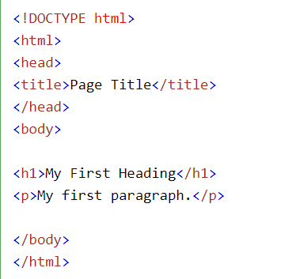

خیلی جاها ممکنه آموزش های مختلف و جورواجوری از **اچ تی ام ال** دیده باشین. من در وبلاگم سعی میکنم راحت ترین روش ها برای یادگیری رو بهتون آموزش بدم و تجربیات خودم رو در اختیارتون بذارم.
  
همونطور که با دوستاتون با زبان خاصی حرف میزنین برای حرف زدن یا فرمان دادن به کاپیوتر هم نیاز هست تا با زبان مخصوصش باهاش ارتباط برقرار کنین. یکی ازین زبان ها **اچ تی ام ال** هستش که به صورت کد نویسی با کامپیوتر ارتباط برقرار میکنه. برای اینکه بتونین یه برنامه نویس یا طراح سایت خوب و حرفه ای بشین یکی از پایه هایی که باید بلد باشین زبان **اچ تی ام ال** هست.
  

